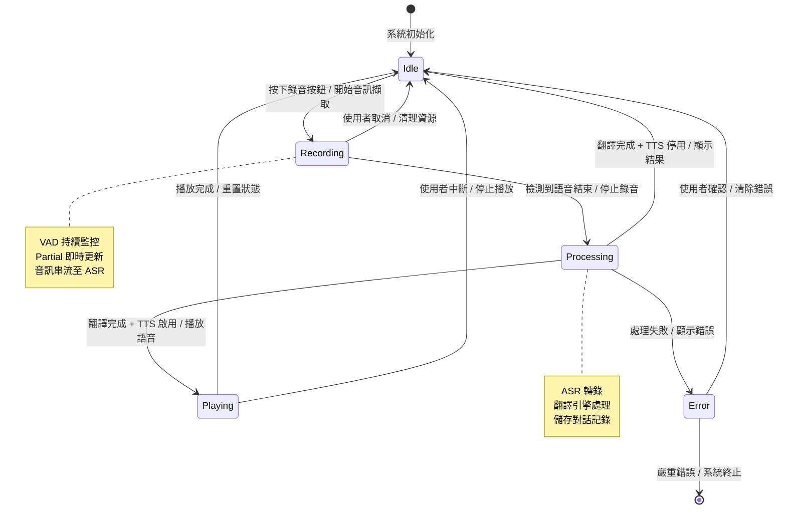
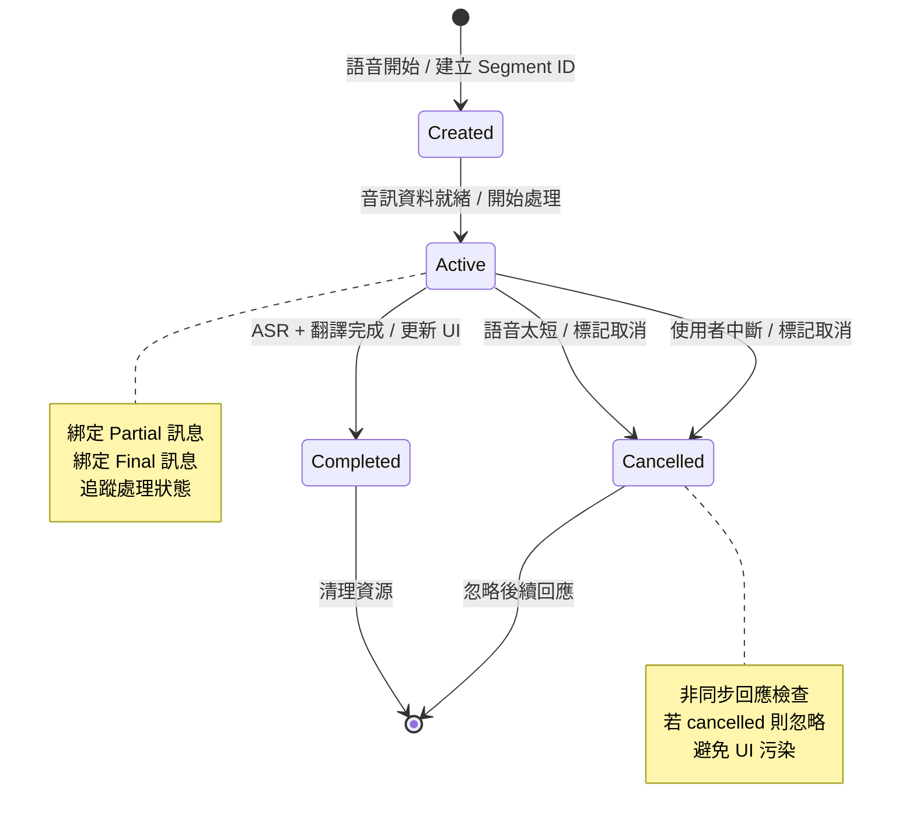
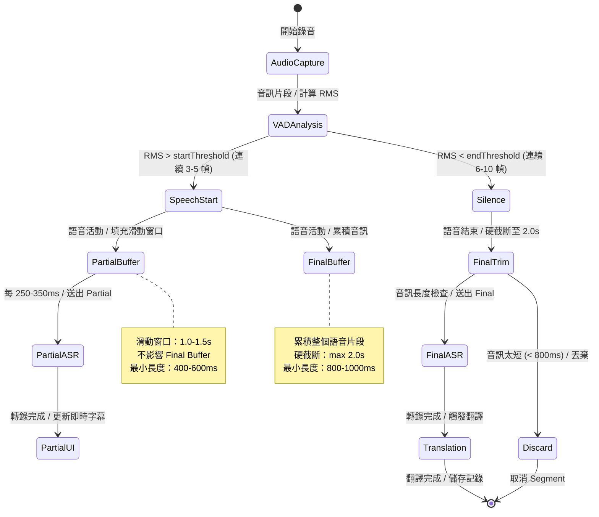
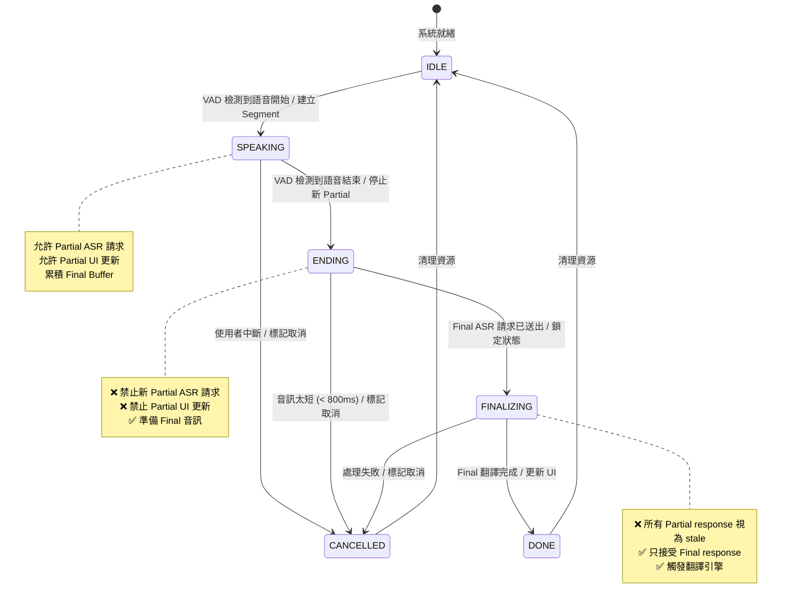

# 即時雙向翻譯系統設計規格

**專案名稱：** 護理推車即時雙向翻譯系統  
**版本：** v1.7.0  
**文件日期：** 2025-01-27  
**作者：** Manus AI

---

## 1. 系統概述

本系統為一套基於 OpenAI Realtime API 的即時雙向翻譯解決方案，專為醫療護理場景設計，支援護理人員與外籍病患之間的即時語音溝通。系統整合語音活動檢測（VAD）、自動語音識別（ASR）、機器翻譯（MT）與文字轉語音（TTS）技術，實現低延遲、高準確度的跨語言對話體驗。

### 1.1 核心功能

系統提供以下核心功能模組：

**語音處理模組**負責即時音訊擷取與處理，採用 WebAudio API 實現 16kHz 單聲道音訊串流，並透過語音活動檢測（VAD）技術自動識別語音片段起止點。該模組支援動態靜音檢測與雜訊過濾，確保只有有效語音片段進入後續處理流程。

**語音識別模組**整合 OpenAI Whisper 系列 ASR 模型與 Realtime Audio 模型。系統採用混合架構設計,透過 Hybrid ASR WebSocket 實現低延遲轉錄,並提供即時字幕(Partial)與最終確認(Final)兩階段輸出機制。具體支援的模型列表定義於 `shared/config.ts` 的 allowlist 中。

**翻譯引擎模組**採用 OpenAI GPT 系列模型執行雙向翻譯任務，支援中文與八種外語（英語、越南語、印尼語、泰語、日語、韓語、菲律賓語、緬甸語）之間的互譯。翻譯引擎針對醫療場景進行優化，保留專業術語準確性，並支援多種翻譯模型（`gpt-4.1-mini`、`gpt-4o-mini`、`gpt-4.1`、`gpt-4o`）動態切換。

**語音合成模組**提供多語言 TTS 功能，支援翻譯結果的語音播放。系統整合 OpenAI TTS API，提供自然流暢的語音輸出，並支援語速調整與音量控制。

**對話管理模組**負責對話記錄的持久化儲存與查詢，採用 MySQL 資料庫儲存對話元資料、訊息內容與效能指標。系統提供完整的對話歷史查詢功能，支援日期範圍篩選、語言篩選與關鍵字搜尋。

### 1.2 技術架構

系統採用前後端分離架構，前端使用 React 19 + TypeScript 構建單頁應用，後端採用 Node.js + Express + tRPC 提供 API 服務。資料持久層使用 MySQL 資料庫，並透過 Drizzle ORM 進行資料存取。系統整合 OpenAI API 提供 AI 能力，並透過 WebSocket 實現即時通訊。

**前端技術棧**包含 React 19 作為 UI 框架，搭配 TypeScript 提供型別安全，使用 Tailwind CSS 4 進行樣式設計，並整合 shadcn/ui 元件庫提供一致的使用者介面。狀態管理採用 React Query（TanStack Query）處理伺服器狀態，並透過 tRPC 實現型別安全的 API 呼叫。

**後端技術棧**採用 Node.js 20+ 作為執行環境，使用 Express 4 作為 Web 框架，並透過 tRPC 11 提供端到端型別安全的 API。資料存取層使用 Drizzle ORM 操作 MySQL 資料庫，並整合 OpenAI SDK 呼叫 AI 服務。系統支援多後端架構，提供 Node.js、Go 與 Hybrid 三種後端實作。

**基礎設施層**包含 MySQL 8.0+ 資料庫提供資料持久化，Nginx 作為反向代理與負載平衡器，並透過 Docker 實現容器化部署。系統整合 Manus Auth 提供 OAuth 認證，並使用 JWT 進行 Session 管理。

---

## 2. 系統架構

### 2.1 整體架構圖

系統採用分層架構設計，從下至上依序為基礎設施層、資料存取層、業務邏輯層、API 層與展示層。各層之間透過明確定義的介面進行通訊，確保系統的可維護性與可擴展性。

```
┌─────────────────────────────────────────────────────────────┐
│                        展示層 (Presentation)                  │
│  React UI │ WebAudio │ WebSocket Client │ tRPC Client        │
└─────────────────────────────────────────────────────────────┘
                              ▲
                              │ HTTPS / WSS
                              ▼
┌─────────────────────────────────────────────────────────────┐
│                         API 層 (API Gateway)                  │
│  tRPC Router │ WebSocket Server │ Auth Middleware            │
└─────────────────────────────────────────────────────────────┘
                              ▲
                              │
                              ▼
┌─────────────────────────────────────────────────────────────┐
│                    業務邏輯層 (Business Logic)                │
│  VAD Engine │ ASR Service │ Translation │ TTS │ Conversation │
└─────────────────────────────────────────────────────────────┘
                              ▲
                              │
                              ▼
┌─────────────────────────────────────────────────────────────┐
│                    資料存取層 (Data Access)                   │
│  Drizzle ORM │ OpenAI SDK │ Hybrid ASR Client                │
└─────────────────────────────────────────────────────────────┘
                              ▲
                              │
                              ▼
┌─────────────────────────────────────────────────────────────┐
│                    基礎設施層 (Infrastructure)                │
│  MySQL │ OpenAI API │ Hybrid ASR WebSocket │ S3 Storage      │
└─────────────────────────────────────────────────────────────┘
```

### 2.2 資料流程

系統資料流程分為語音輸入流程與翻譯輸出流程兩個主要路徑。語音輸入流程從使用者麥克風開始，經過音訊處理、VAD 檢測、ASR 轉錄、翻譯引擎處理，最終輸出翻譯結果與 TTS 語音。翻譯輸出流程則從翻譯結果開始，經過 TTS 合成與音訊播放，最終呈現給使用者。

**語音輸入流程**的詳細步驟如下：使用者透過麥克風輸入語音，前端 WebAudio API 擷取音訊串流並轉換為 16kHz PCM 格式。VAD 引擎即時分析音訊能量，檢測語音活動起止點。當檢測到語音片段時，系統將音訊資料透過 WebSocket 傳送至 Hybrid ASR 服務。ASR 服務執行語音識別，產生即時字幕（Partial）與最終轉錄（Final）結果。系統接收 ASR 輸出後，觸發翻譯引擎進行語言轉換。翻譯完成後，系統將結果儲存至資料庫，並透過 tRPC 回傳前端顯示。若啟用 TTS 功能，系統會呼叫 OpenAI TTS API 合成語音，並透過前端播放。

**資料持久化流程**確保對話記錄的完整性與可追溯性。系統在對話開始時建立 Conversation 記錄，包含對話 ID、使用者 ID、語言設定與時間戳記。每個語音片段產生的訊息會儲存為 Message 記錄，包含原文、譯文、語言、時間戳記與效能指標。系統同時記錄 Performance 資料，包含 ASR 延遲、翻譯延遲、TTS 延遲與端到端延遲，用於效能分析與優化。

### 2.3 核心模組

#### 2.3.1 VAD 引擎

VAD（Voice Activity Detection）引擎負責即時檢測語音活動，採用雙門檻演算法降低誤判率。系統計算音訊片段的 RMS（Root Mean Square）能量值，並與動態門檻值進行比較。當連續多幀音訊能量超過啟動門檻（startThreshold）時，系統判定語音開始；當連續多幀音訊能量低於結束門檻（endThreshold）時，系統判定語音結束。

VAD 引擎採用滑動窗口機制，維護固定長度的音訊緩衝區。系統持續分析最近的音訊片段，並根據能量變化動態調整檢測狀態。為避免短暫雜訊觸發誤判，系統引入連續幀數判定機制，要求連續 3-5 幀超過啟動門檻才判定為語音開始，連續 6-10 幀低於結束門檻才判定為語音結束。

#### 2.3.2 ASR 服務

ASR（Automatic Speech Recognition）服務提供語音轉文字功能，支援多種 Whisper 模型。系統採用混合架構設計，透過 Hybrid ASR WebSocket 實現低延遲轉錄。ASR 服務接收音訊串流後，執行即時語音識別，並產生兩階段輸出：

**Partial 輸出**提供即時字幕功能，系統每隔固定時間間隔（250-350ms）產生部分轉錄結果。Partial 輸出採用滑動窗口機制，只處理最近 1.0-1.5 秒的音訊片段，確保即時性。系統會過濾過短的 Partial 結果（< 400-600ms），避免雜訊干擾。

**Final 輸出**提供最終確認的轉錄結果，當語音片段結束時產生。Final 輸出採用累積機制，處理整個語音片段的音訊資料。系統會對 Final 音訊進行硬截斷（hard-trim），確保長度不超過 2.0 秒，避免超時錯誤。系統同時會過濾過短的 Final 結果（< 800-1000ms），視為雜訊片段。

ASR 服務整合輸出清洗機制，過濾非轉錄性句子（如 "Speaker likely speaks..."、"The speaker is..."、"This audio..."）與多語名詞誤判（如 "Chinese"、"Vietnamese"、"English"、"Indonesian"），確保輸出品質。

#### 2.3.3 翻譯引擎

翻譯引擎負責雙向語言轉換，支援中文與八種外語之間的互譯。系統採用 OpenAI GPT 系列模型執行翻譯任務，並針對醫療場景進行 Prompt 優化。翻譯引擎接收 ASR 輸出後，根據來源語言與目標語言選擇適當的翻譯方向。

翻譯引擎採用結構化輸出機制，要求模型回傳 JSON 格式的翻譯結果，包含譯文、信心分數與錯誤訊息。系統會驗證翻譯結果的完整性與正確性，若發現錯誤則重試或回報異常。翻譯引擎支援多種模型切換，使用者可根據延遲與品質需求選擇適當的模型。

#### 2.3.4 Segment 機制

Segment 機制解決非同步競態條件問題，確保 UI 更新的一致性。系統在每次語音開始時建立唯一的 Segment ID（自增或 UUID），並將所有相關的 Partial 與 Final 訊息綁定至該 Segment。當語音片段結束或被取消時，系統將 Segment 標記為 cancelled 狀態。

非同步回應（ASR 或翻譯）回傳時，系統會檢查對應的 Segment 是否仍為 active 狀態。若 Segment 已被取消，系統會忽略該回應，不更新 UI 也不觸發後續處理。此機制有效避免「語音太短被丟棄後，非同步回應仍想更新 UI」的問題。

---

## 3. 狀態機設計

### 3.1 對話狀態機

系統對話流程採用有限狀態機（FSM）設計，定義明確的狀態轉換規則。對話狀態機包含五個主要狀態：Idle（閒置）、Recording（錄音中）、Processing（處理中）、Playing（播放中）與 Error（錯誤）。



**狀態轉換規則**定義如下：

**Idle 狀態**為系統初始狀態，等待使用者輸入。當使用者按下錄音按鈕時，系統轉換至 Recording 狀態，並開始音訊擷取。系統會初始化 WebAudio 資源、建立 Segment ID，並啟動 VAD 引擎。

**Recording 狀態**表示系統正在錄音，VAD 引擎持續監控語音活動。系統會即時產生 Partial 字幕，並將音訊串流至 ASR 服務。當 VAD 檢測到語音結束時，系統轉換至 Processing 狀態，並停止錄音。若使用者手動取消錄音，系統會清理資源並返回 Idle 狀態。

**Processing 狀態**表示系統正在處理語音資料，包含 ASR 轉錄、翻譯引擎處理與對話記錄儲存。當翻譯完成且 TTS 功能啟用時，系統轉換至 Playing 狀態並播放語音。若 TTS 功能停用，系統直接返回 Idle 狀態並顯示結果。若處理過程中發生錯誤，系統轉換至 Error 狀態。

**Playing 狀態**表示系統正在播放 TTS 語音。當播放完成或使用者中斷播放時，系統返回 Idle 狀態並重置狀態。

**Error 狀態**表示系統發生錯誤，顯示錯誤訊息並等待使用者確認。使用者確認後，系統清除錯誤並返回 Idle 狀態。若發生嚴重錯誤（如網路中斷、API 金鑰無效），系統可能終止執行。

### 3.2 Segment 生命週期

Segment 機制管理單一語音片段的完整生命週期，從建立到完成或取消。Segment 狀態機包含四個狀態：Created（已建立）、Active（活躍）、Completed（已完成）與 Cancelled（已取消）。



**Segment 生命週期**的詳細流程如下：

**Created 狀態**表示 Segment 已建立但尚未開始處理。系統在檢測到語音開始時建立 Segment，分配唯一的 Segment ID，並初始化相關資料結構。當音訊資料就緒時，系統轉換至 Active 狀態。

**Active 狀態**表示 Segment 正在處理中，所有 Partial 與 Final 訊息都會綁定至該 Segment。系統追蹤處理狀態，包含 ASR 是否完成、翻譯是否完成、TTS 是否完成。當所有處理完成時，系統轉換至 Completed 狀態並更新 UI。

**Cancelled 狀態**表示 Segment 已被取消，後續的非同步回應應被忽略。系統在以下情況下會取消 Segment：語音片段太短（< 800-1000ms）、使用者手動中斷錄音、VAD 檢測到長時間靜音。當非同步回應回傳時，系統會檢查 Segment 狀態，若為 Cancelled 則忽略該回應。

**Completed 狀態**表示 Segment 處理完成，系統會清理相關資源並釋放記憶體。

### 3.3 音訊處理流程

音訊處理流程分為 Partial 路徑與 Final 路徑，兩者採用不同的音訊緩衝策略。



**Partial 路徑**採用滑動窗口機制，維護固定長度（1.0-1.5 秒）的音訊緩衝區。系統每隔 250-350ms 將窗口內的音訊送至 ASR 服務，產生即時字幕。Partial 路徑不會影響 Final Buffer 的狀態，兩者完全獨立。系統會過濾過短的 Partial 結果（< 400-600ms），避免雜訊干擾。

**Final 路徑**採用累積機制，儲存整個語音片段的音訊資料。當 VAD 檢測到語音結束時，系統會對累積的音訊進行硬截斷（hard-trim），確保長度不超過 2.0 秒。若音訊長度符合要求（≥ 800-1000ms），系統將音訊送至 ASR 服務產生最終轉錄。若音訊太短，系統會丟棄該片段並取消對應的 Segment。


### 3.4 Segment 執行期一致性規範

本節定義 Segment 在執行期（runtime）的強制性行為規則,確保即時字幕（Partial）與最終翻譯（Final）的狀態一致性,避免非同步競態條件導致的 UI 污染、重複觸發與過期回應問題。

#### 3.4.1 Segment 細化狀態機

為精確控制即時字幕與 Final 處理的執行期行為,Segment 狀態機在原有 Created → Active → Completed/Cancelled 基礎上,細化為以下五個狀態:



**狀態定義與轉換規則:**

**IDLE 狀態**表示系統就緒,等待語音輸入。此狀態下無 Segment 實例存在,所有緩衝區已清空。

**SPEAKING 狀態**表示語音活動進行中,系統執行以下操作:
- ✅ 允許 Partial ASR 請求（受 in-flight lock 約束,見 3.4.2）
- ✅ 允許 Partial response 更新 UI
- ✅ 累積 Final Buffer（獨立於 Partial Buffer）
- ✅ 持續監控 VAD 狀態

當 VAD 檢測到語音結束時,系統**必須**立即轉換至 ENDING 狀態。

**ENDING 狀態**表示語音已結束但 Final 處理尚未開始,系統執行以下操作:
- ❌ **禁止**送出新的 Partial ASR 請求（即使 Partial throttle timer 觸發）
- ❌ **禁止**接受任何 Partial response 更新 UI（即使 response 尚未回傳）
- ✅ 對 Final Buffer 執行 hard-trim（見 3.4.4）
- ✅ 檢查 Final 音訊長度是否符合 `minFinalDurationMs` 要求

若 Final 音訊長度 < `minFinalDurationMs`,系統**必須**轉換至 CANCELLED 狀態並丟棄該 Segment。

若 Final 音訊長度符合要求,系統**必須**轉換至 FINALIZING 狀態並送出 Final ASR 請求。

**FINALIZING 狀態**表示 Final ASR 與翻譯處理進行中,系統執行以下操作:
- ❌ **所有** Partial response（包含 in-flight 的請求）**必須**視為 stale 並丟棄
- ✅ 只接受 Final ASR response
- ✅ Final ASR 完成後觸發翻譯引擎
- ✅ 翻譯完成後更新 UI 並儲存記錄

當翻譯完成時,系統**必須**轉換至 DONE 狀態。

**CANCELLED 狀態**表示 Segment 已取消,系統**必須**忽略所有後續的非同步回應（Partial 或 Final）,不更新 UI 也不觸發後續處理。

**DONE 狀態**表示 Segment 處理完成,系統清理資源並返回 IDLE 狀態。

#### 3.4.2 Partial ASR In-Flight Lock

為避免 Partial ASR 請求並行導致的回應亂序與 UI 閃爍,系統**必須**實作 in-flight lock 機制:

**規則 1: 單一 In-Flight 請求**
- 每個 Segment 在 SPEAKING 狀態下,同時間**只能**有一個 Partial ASR 請求在處理中（in-flight）
- 系統**必須**維護 `partialInFlight: boolean` 旗標追蹤狀態

**規則 2: Throttle Tick 跳過邏輯**
- 當 Partial throttle timer 觸發時（每 `partialThrottleMs` 毫秒）,系統**必須**先檢查:
  1. Segment 狀態是否為 SPEAKING（若非 SPEAKING 則跳過）
  2. `partialInFlight` 是否為 `false`（若為 `true` 則跳過）
- 只有兩個條件**同時**滿足時,才允許送出新的 Partial ASR 請求

**規則 3: 旗標生命週期**
- 送出 Partial ASR 請求前:**必須**設定 `partialInFlight = true`
- 收到 Partial ASR response 後:**必須**設定 `partialInFlight = false`（無論成功或失敗）
- Segment 轉換至 ENDING/FINALIZING/CANCELLED 狀態時:**必須**重置 `partialInFlight = false`

**實作範例（TypeScript 偽代碼）:**

```typescript
class Segment {
  private partialInFlight = false;
  private state: 'IDLE' | 'SPEAKING' | 'ENDING' | 'FINALIZING' | 'DONE' | 'CANCELLED' = 'IDLE';

  async onPartialThrottleTick() {
    // 規則 2: 檢查是否允許送出請求
    if (this.state !== 'SPEAKING') return; // 跳過
    if (this.partialInFlight) return; // 跳過（上一個請求尚未回傳）

    // 規則 3: 設定旗標
    this.partialInFlight = true;

    try {
      const response = await sendPartialASR(this.partialBuffer);
      if (this.state === 'SPEAKING') { // 確認狀態未改變
        this.updatePartialUI(response);
      }
    } finally {
      // 規則 3: 重置旗標
      this.partialInFlight = false;
    }
  }

  onSpeechEnd() {
    this.state = 'ENDING';
    this.partialInFlight = false; // 規則 3: 重置旗標
  }
}
```

#### 3.4.3 Stale Response 丟棄規則

為避免過期的 Partial response 更新 UI（導致字幕回跳）,系統**必須**實作序號機制追蹤請求新鮮度:

**規則 1: 請求序號分配**
- 每個 Segment **必須**維護 `partialSeq: number` 計數器,初始值為 `0`
- 每次送出 Partial ASR 請求前,系統**必須**遞增 `partialSeq`
- 請求**必須**攜帶當前的 `partialSeq` 值（作為 metadata 或 request ID）

**規則 2: 回應新鮮度檢查**
- 收到 Partial ASR response 時,系統**必須**檢查:
  1. Segment 狀態是否為 SPEAKING（若非 SPEAKING 則丟棄）
  2. Response 的 `partialSeq` 是否等於當前 Segment 的 `partialSeq`（若不等則丟棄）
- 只有兩個條件**同時**滿足時,才允許更新 UI

**規則 3: 狀態轉換時的序號處理**
- Segment 轉換至 ENDING/FINALIZING 狀態時,系統**可選**遞增 `partialSeq`,使所有 in-flight 的 Partial response 自動失效
- Segment 轉換至 CANCELLED 狀態時,系統**必須**忽略所有後續回應（無論序號）

**實作範例（TypeScript 偽代碼）:**

```typescript
class Segment {
  private partialSeq = 0;

  async sendPartialASR() {
    // 規則 1: 遞增序號
    this.partialSeq++;
    const currentSeq = this.partialSeq;

    const response = await hybridASRClient.transcribe({
      audio: this.partialBuffer,
      metadata: { segmentId: this.id, partialSeq: currentSeq }
    });

    // 規則 2: 新鮮度檢查
    if (this.state !== 'SPEAKING') return; // 丟棄
    if (response.metadata.partialSeq !== this.partialSeq) return; // 丟棄（過期回應）

    this.updatePartialUI(response.text);
  }

  onSpeechEnd() {
    this.state = 'ENDING';
    this.partialSeq++; // 規則 3: 使所有 in-flight Partial 失效
  }
}
```

#### 3.4.4 Final Hard-Trim 強制規則

為確保 Final ASR 請求不會因音訊過長導致超時錯誤（如 OpenAI API 的 2 秒限制）,系統**必須**在**所有**觸發 Final 處理的路徑上執行 hard-trim:

**規則 1: Hard-Trim 適用範圍**

Final 音訊**必須**在以下**所有**情況下執行 hard-trim:
1. **VAD speech-end**: VAD 檢測到語音結束時
2. **Auto-cut**: 語音片段超過 `maxFinalDurationSec` 時自動切段
3. **Manual stop**: 使用者手動按下停止錄音按鈕時
4. **Timeout cut**: 系統因超時保護機制強制切段時

**規則 2: Hard-Trim 執行時機**

系統**必須**在 Segment 轉換至 ENDING 狀態時,立即對 Final Buffer 執行 hard-trim:

```typescript
function hardTrimFinalBuffer(buffer: Float32Array, maxDurationSec: number): Float32Array {
  const sampleRate = 16000; // 16kHz
  const maxSamples = Math.floor(maxDurationSec * sampleRate);
  
  if (buffer.length <= maxSamples) {
    return buffer; // 無需截斷
  }
  
  // 從尾部截取最後 maxDurationSec 秒
  return buffer.slice(buffer.length - maxSamples);
}
```

**規則 3: Hard-Trim 參數**

- `maxFinalDurationSec` 預設值為 `2.0` 秒（對應 OpenAI API 限制）
- 系統**不得**將超過 `maxFinalDurationSec` 的音訊送至 ASR 服務
- Hard-trim 後的音訊**必須**仍符合 `minFinalDurationMs` 要求,否則**必須**取消 Segment

**規則 4: 截斷策略**

系統**必須**採用「保留尾部」策略（tail-preserving）:
- 若音訊長度為 3.5 秒,`maxFinalDurationSec` 為 2.0 秒,系統**必須**保留最後 2.0 秒
- 此策略確保保留最接近語音結束點的內容,提高 ASR 準確度

**規則 5: 日誌記錄**

當 hard-trim 實際執行截斷時（音訊長度 > `maxFinalDurationSec`）,系統**必須**記錄以下資訊:
- Segment ID
- 原始音訊長度
- 截斷後音訊長度
- 觸發路徑（VAD/auto-cut/manual/timeout）

此資訊用於監控與優化 VAD 參數。

#### 3.4.5 執行期一致性檢查清單

實作者**必須**確保以下檢查點全部通過:

**Segment 狀態機檢查:**
- [ ] Segment 進入 ENDING 後,不再送出新的 Partial ASR 請求
- [ ] Segment 進入 ENDING 後,不再接受 Partial response 更新 UI
- [ ] Segment 進入 FINALIZING 後,所有 Partial response 被丟棄
- [ ] Segment 在 CANCELLED 狀態下,忽略所有非同步回應

**Partial ASR 並行控制檢查:**
- [ ] 同時間只有一個 Partial ASR 請求 in-flight
- [ ] Partial throttle tick 在 `partialInFlight = true` 時跳過
- [ ] `partialInFlight` 旗標在 response 回傳後正確重置

**Stale Response 檢查:**
- [ ] 每個 Partial ASR 請求攜帶唯一的 `partialSeq`
- [ ] Partial response 更新 UI 前檢查 `partialSeq` 是否匹配
- [ ] 過期的 Partial response 被正確丟棄

**Final Hard-Trim 檢查:**
- [ ] VAD speech-end 路徑執行 hard-trim
- [ ] Auto-cut 路徑執行 hard-trim
- [ ] Manual stop 路徑執行 hard-trim
- [ ] Hard-trim 後音訊長度 ≤ `maxFinalDurationSec`
- [ ] Hard-trim 採用「保留尾部」策略

**日誌與可觀測性檢查:**
- [ ] Speech END 事件只觸發一次（記錄 Segment 狀態轉換）
- [ ] Partial response 丟棄事件被記錄（含原因: stale/cancelled/wrong-state）
- [ ] Final hard-trim 執行被記錄（含原始/截斷後長度）

---

**本節規範為強制性要求,所有實作**必須**嚴格遵守,以確保系統在高並發與複雜對話場景下的穩定性與一致性。**

---

## 4. OpenAI Realtime API 參數

### 4.1 ASR 模型參數

系統支援四種 Whisper ASR 模型，各模型具有不同的效能特性與適用場景。

| 參數名稱 | 資料型別 | 預設值 | 說明 | 可選值 |
|---------|---------|--------|------|--------|
| `model` | string | 系統預設 | ASR 模型識別碼 | 支援的模型列表請參考 `shared/config.ts` 中的 `ALLOWED_ASR_MODELS` |
| `language` | string | `auto` | 來源語言代碼（ISO-639-1） | `zh`, `en`, `vi`, `id`, `th`, `ja`, `ko`, `tl`, `my`, `auto` |
| `temperature` | number | `0.0` | 取樣溫度，控制輸出隨機性 | `0.0` - `1.0` |
| `response_format` | string | `json` | 回應格式 | `json`, `text`, `verbose_json` |
| `timestamp_granularities` | array | `["segment"]` | 時間戳記粒度 | `["segment"]`, `["word"]`, `["segment", "word"]` |

**模型選擇建議**：系統支援多種 Whisper 系列 ASR 模型與 Realtime Audio 模型，各模型具有不同的延遲、品質與功能特性。具體支援的模型列表請參考 `shared/config.ts` 中的 `ALLOWED_ASR_MODELS`。

**基礎 ASR 模型**提供穩定的轉錄品質與較低的 API 成本，適用於一般對話場景，支援多語言轉錄。

**快速 ASR 模型**提供最佳的速度與成本平衡，適用於即時對話場景，在保持良好轉錄品質的同時大幅降低 API 成本。

**高品質 ASR 模型**提供更高的轉錄準確度與更好的雜訊抑制能力，適用於複雜對話場景與醫療專業場景，在專業術語識別與口音適應上表現優異。

**進階 ASR 模型**在高品質模型基礎上加入說話者辨識（Speaker Diarization）與詳細時間資訊，適用於多人對話場景與會議記錄。

**Realtime Audio 模型**支援即時音訊處理，提供最低延遲的轉錄體驗，適用於對延遲極度敏感的場景。

### 4.2 翻譯模型參數

系統支援多種 GPT 模型執行翻譯任務，各模型具有不同的延遲與品質特性。

| 參數名稱 | 資料型別 | 預設值 | 說明 | 可選值 |
|---------|---------|--------|------|--------|
| `model` | string | `gpt-4.1-mini` | 翻譯模型識別碼 | `gpt-4.1-mini`, `gpt-4o-mini`, `gpt-4.1`, `gpt-4o` |
| `temperature` | number | `0.3` | 取樣溫度，控制翻譯創意性 | `0.0` - `1.0` |
| `max_tokens` | number | `500` | 最大輸出 Token 數 | `1` - `4096` |
| `top_p` | number | `1.0` | Nucleus sampling 參數 | `0.0` - `1.0` |
| `frequency_penalty` | number | `0.0` | 頻率懲罰，降低重複詞彙 | `-2.0` - `2.0` |
| `presence_penalty` | number | `0.0` | 存在懲罰，鼓勵新詞彙 | `-2.0` - `2.0` |
| `response_format` | object | `{"type": "json_schema"}` | 結構化輸出格式 | JSON Schema 定義 |

**模型選擇建議**如下：

**gpt-4o** 為旗艦模型，提供最高的翻譯品質與最佳的專業術語處理能力。適用於醫療場景與高品質要求場景（Quality Pass），延遲約 1.0-1.5 秒。該模型支援複雜句式翻譯與文化適應性調整，是兩段式翻譯流程中 Quality Pass 的預設選擇。

**gpt-4.1-mini** 為快速翻譯模型（**系統預設**），提供最佳的速度與品質平衡。適用於即時翻譯場景（Fast Pass），延遲約 0.8-1.2 秒。該模型在保持良好翻譯品質的同時提供快速回應，是兩段式翻譯流程中 Fast Pass 的預設選擇。

**gpt-4.1** 為高品質翻譯模型，提供優異的翻譯品質與專業術語處理能力。適用於進階翻譯場景，延遲約 1.2-1.8 秒。該模型在醫療術語翻譯與文化適應性上表現優異，可作為 Quality Pass 的替代選擇。

**gpt-4o-mini** 為輕量模型，在保持高品質的同時大幅降低延遲與成本。適用於一般對話場景，延遲約 0.8-1.3 秒。該模型提供良好的效能與成本平衡，可作為 Fast Pass 的替代選擇（非預設模型）。


### 4.3 TTS 參數

系統整合 OpenAI TTS API 提供語音合成功能，支援多種語音與語速調整。

| 參數名稱 | 資料型別 | 預設值 | 說明 | 可選值 |
|---------|---------|--------|------|--------|
| `model` | string | `tts-1` | TTS 模型識別碼 | `tts-1`, `tts-1-hd` |
| `voice` | string | `alloy` | 語音識別碼 | `alloy`, `echo`, `fable`, `onyx`, `nova`, `shimmer` |
| `speed` | number | `1.0` | 語速倍率 | `0.25` - `4.0` |
| `response_format` | string | `mp3` | 音訊格式 | `mp3`, `opus`, `aac`, `flac` |

**語音選擇建議**如下：

**alloy** 為中性語音，適用於一般對話場景。該語音具有清晰的發音與自然的語調，適合長時間聆聽。

**echo** 為男性語音，具有沉穩的音色與較低的音調。適用於正式場景與專業內容播報。

**fable** 為英式口音語音，具有優雅的發音與流暢的語調。適用於教育場景與文學內容播報。

**onyx** 為深沉男性語音，具有權威感與專業感。適用於新聞播報與嚴肅內容。

**nova** 為年輕女性語音，具有活潑的語調與親和力。適用於客服場景與互動式對話。

**shimmer** 為溫柔女性語音，具有柔和的音色與舒緩的語調。適用於醫療場景與關懷性對話。

### 4.4 VAD 參數

系統 VAD 引擎採用雙門檻演算法，支援多種參數調整以適應不同環境。

| 參數名稱 | 資料型別 | 預設值 | 說明 | 建議範圍 |
|---------|---------|--------|------|---------|
| `startThreshold` | number | `0.060` | 語音開始門檻（RMS 能量值） | `0.050` - `0.080` |
| `endThreshold` | number | `0.045` | 語音結束門檻（RMS 能量值） | `0.030` - `0.060` |
| `startFrames` | number | `4` | 語音開始所需連續幀數 | `3` - `5` |
| `endFrames` | number | `8` | 語音結束所需連續幀數 | `6` - `10` |
| `minPartialDurationMs` | number | `500` | Partial 最小長度（毫秒） | `400` - `600` |
| `minFinalDurationMs` | number | `900` | Final 最小長度（毫秒） | `800` - `1000` |
| `maxFinalDurationSec` | number | `2.0` | Final 最大長度（秒） | `1.5` - `3.0` |
| `partialWindowSec` | number | `1.25` | Partial 滑動窗口長度（秒） | `1.0` - `1.5` |
| `partialThrottleMs` | number | `300` | Partial 節流間隔（毫秒） | `250` - `350` |

**參數調整建議**如下：

**安靜環境**（如診間、病房）建議使用較低的門檻值，`startThreshold` 設為 `0.050`，`endThreshold` 設為 `0.035`，以提高靈敏度並捕捉輕聲對話。

**一般環境**（如護理站、走廊）建議使用預設門檻值，`startThreshold` 設為 `0.060`，`endThreshold` 設為 `0.045`，平衡靈敏度與抗噪能力。

**嘈雜環境**（如急診室、公共區域）建議使用較高的門檻值，`startThreshold` 設為 `0.070`，`endThreshold` 設為 `0.055`，以降低誤判率並過濾環境雜訊。

**連續幀數**參數控制檢測穩定性，較高的值可降低誤判但會增加延遲。建議在安靜環境使用較低值（`startFrames: 3`, `endFrames: 6`），在嘈雜環境使用較高值（`startFrames: 5`, `endFrames: 10`）。

**音訊長度限制**參數確保系統穩定性，`minPartialDurationMs` 過濾過短的即時字幕，`minFinalDurationMs` 過濾雜訊片段，`maxFinalDurationSec` 避免超時錯誤。建議根據實際延遲需求調整這些參數。

---

## 5. 資料庫設計

### 5.1 資料表結構

系統採用關聯式資料庫設計，包含四個核心資料表：`users`、`conversations`、`messages` 與 `performance_metrics`。

#### 5.1.1 users 表

使用者資料表儲存系統使用者的基本資訊與認證資料。

| 欄位名稱 | 資料型別 | 約束條件 | 說明 |
|---------|---------|---------|------|
| `id` | INT | PRIMARY KEY, AUTO_INCREMENT | 使用者唯一識別碼 |
| `openId` | VARCHAR(64) | NOT NULL, UNIQUE | Manus OAuth 識別碼 |
| `name` | TEXT | NULL | 使用者姓名 |
| `email` | VARCHAR(320) | NULL | 使用者電子郵件 |
| `loginMethod` | VARCHAR(64) | NULL | 登入方式（manus, google, github） |
| `role` | ENUM('user', 'admin') | NOT NULL, DEFAULT 'user' | 使用者角色 |
| `createdAt` | TIMESTAMP | NOT NULL, DEFAULT CURRENT_TIMESTAMP | 建立時間 |
| `updatedAt` | TIMESTAMP | NOT NULL, DEFAULT CURRENT_TIMESTAMP ON UPDATE CURRENT_TIMESTAMP | 更新時間 |
| `lastSignedIn` | TIMESTAMP | NOT NULL, DEFAULT CURRENT_TIMESTAMP | 最後登入時間 |

**索引設計**：在 `openId` 欄位建立唯一索引，加速使用者查詢與認證流程。在 `email` 欄位建立一般索引，支援郵件查詢功能。

#### 5.1.2 conversations 表

對話資料表儲存對話的元資料與設定資訊。

| 欄位名稱 | 資料型別 | 約束條件 | 說明 |
|---------|---------|---------|------|
| `id` | INT | PRIMARY KEY, AUTO_INCREMENT | 對話唯一識別碼 |
| `userId` | INT | NOT NULL, FOREIGN KEY(users.id) | 使用者識別碼 |
| `title` | VARCHAR(255) | NULL | 對話標題 |
| `sourceLanguage` | VARCHAR(10) | NOT NULL | 來源語言代碼 |
| `targetLanguage` | VARCHAR(10) | NOT NULL | 目標語言代碼 |
| `asrModel` | VARCHAR(50) | NOT NULL | ASR 模型識別碼 |
| `translationModel` | VARCHAR(50) | NOT NULL | 翻譯模型識別碼 |
| `ttsEnabled` | BOOLEAN | NOT NULL, DEFAULT TRUE | TTS 功能啟用狀態 |
| `createdAt` | TIMESTAMP | NOT NULL, DEFAULT CURRENT_TIMESTAMP | 建立時間 |
| `updatedAt` | TIMESTAMP | NOT NULL, DEFAULT CURRENT_TIMESTAMP ON UPDATE CURRENT_TIMESTAMP | 更新時間 |
| `endedAt` | TIMESTAMP | NULL | 結束時間 |

**索引設計**：在 `userId` 欄位建立一般索引，加速使用者對話查詢。在 `createdAt` 欄位建立一般索引，支援時間範圍查詢。建立複合索引 `(userId, createdAt)` 優化使用者歷史記錄查詢。

#### 5.1.3 messages 表

訊息資料表儲存對話中的每條訊息內容與翻譯結果。

| 欄位名稱 | 資料型別 | 約束條件 | 說明 |
|---------|---------|---------|------|
| `id` | INT | PRIMARY KEY, AUTO_INCREMENT | 訊息唯一識別碼 |
| `conversationId` | INT | NOT NULL, FOREIGN KEY(conversations.id) | 對話識別碼 |
| `segmentId` | VARCHAR(64) | NOT NULL | Segment 識別碼 |
| `originalText` | TEXT | NOT NULL | 原文內容 |
| `translatedText` | TEXT | NULL | 譯文內容 |
| `sourceLanguage` | VARCHAR(10) | NOT NULL | 來源語言代碼 |
| `targetLanguage` | VARCHAR(10) | NOT NULL | 目標語言代碼 |
| `messageType` | ENUM('partial', 'final') | NOT NULL | 訊息類型 |
| `asrDurationMs` | INT | NULL | ASR 處理時間（毫秒） |
| `translationDurationMs` | INT | NULL | 翻譯處理時間（毫秒） |
| `ttsDurationMs` | INT | NULL | TTS 處理時間（毫秒） |
| `createdAt` | TIMESTAMP | NOT NULL, DEFAULT CURRENT_TIMESTAMP | 建立時間 |

**索引設計**：在 `conversationId` 欄位建立一般索引，加速對話訊息查詢。在 `segmentId` 欄位建立一般索引，支援 Segment 追蹤。建立複合索引 `(conversationId, createdAt)` 優化訊息時間序列查詢。

#### 5.1.4 performance_metrics 表

效能指標資料表儲存系統效能監控資料。

| 欄位名稱 | 資料型別 | 約束條件 | 說明 |
|---------|---------|---------|------|
| `id` | INT | PRIMARY KEY, AUTO_INCREMENT | 指標唯一識別碼 |
| `conversationId` | INT | NOT NULL, FOREIGN KEY(conversations.id) | 對話識別碼 |
| `messageId` | INT | NOT NULL, FOREIGN KEY(messages.id) | 訊息識別碼 |
| `asrLatencyMs` | INT | NOT NULL | ASR 延遲（毫秒） |
| `translationLatencyMs` | INT | NOT NULL | 翻譯延遲（毫秒） |
| `ttsLatencyMs` | INT | NULL | TTS 延遲（毫秒） |
| `e2eLatencyMs` | INT | NOT NULL | 端到端延遲（毫秒） |
| `audioDurationMs` | INT | NOT NULL | 音訊長度（毫秒） |
| `audioBufferCount` | INT | NOT NULL | 音訊緩衝區數量 |
| `vadStartThreshold` | FLOAT | NOT NULL | VAD 開始門檻 |
| `vadEndThreshold` | FLOAT | NOT NULL | VAD 結束門檻 |
| `createdAt` | TIMESTAMP | NOT NULL, DEFAULT CURRENT_TIMESTAMP | 建立時間 |

**索引設計**：在 `conversationId` 欄位建立一般索引，支援對話效能分析。在 `messageId` 欄位建立唯一索引，確保一對一關聯。在 `createdAt` 欄位建立一般索引，支援時間序列分析。

### 5.2 資料關聯

系統資料表之間的關聯關係如下：

**users 與 conversations** 為一對多關係，一個使用者可以建立多個對話，每個對話屬於一個使用者。外鍵約束確保資料完整性，當使用者被刪除時，相關對話可選擇級聯刪除或設為 NULL。

**conversations 與 messages** 為一對多關係，一個對話包含多條訊息，每條訊息屬於一個對話。外鍵約束確保訊息不會成為孤兒記錄，當對話被刪除時，相關訊息應級聯刪除。

**messages 與 performance_metrics** 為一對一關係，每條訊息對應一筆效能指標記錄。外鍵約束確保效能資料的完整性，當訊息被刪除時，相關效能記錄應級聯刪除。

---

## 6. API 設計

### 6.1 tRPC 路由結構

系統採用 tRPC 提供端到端型別安全的 API，路由結構如下：

```
appRouter
├── auth
│   ├── me (query) - 取得當前使用者資訊
│   └── logout (mutation) - 登出
├── conversation
│   ├── create (mutation) - 建立對話
│   ├── list (query) - 列出對話清單
│   ├── get (query) - 取得對話詳情
│   ├── end (mutation) - 結束對話
│   └── delete (mutation) - 刪除對話
├── message
│   ├── list (query) - 列出訊息清單
│   ├── create (mutation) - 建立訊息
│   └── update (mutation) - 更新訊息
├── asr
│   ├── transcribe (mutation) - 語音轉文字
│   └── transcribeStream (subscription) - 串流語音轉文字
├── translation
│   └── translate (mutation) - 文字翻譯
├── tts
│   └── synthesize (mutation) - 文字轉語音
└── system
    ├── health (query) - 系統健康檢查
    └── notifyOwner (mutation) - 通知系統擁有者
```

### 6.2 核心 API 規格

#### 6.2.1 conversation.create

建立新對話並初始化設定。

**輸入參數：**

```typescript
{
  title?: string;              // 對話標題（可選）
  sourceLanguage: string;      // 來源語言代碼
  targetLanguage: string;      // 目標語言代碼
  asrModel: string;            // ASR 模型識別碼
  translationModel: string;    // 翻譯模型識別碼
  ttsEnabled: boolean;         // TTS 功能啟用狀態
}
```

**輸出結果：**

```typescript
{
  id: number;                  // 對話識別碼
  userId: number;              // 使用者識別碼
  title: string | null;        // 對話標題
  sourceLanguage: string;      // 來源語言代碼
  targetLanguage: string;      // 目標語言代碼
  asrModel: string;            // ASR 模型識別碼
  translationModel: string;    // 翻譯模型識別碼
  ttsEnabled: boolean;         // TTS 功能啟用狀態
  createdAt: Date;             // 建立時間
  updatedAt: Date;             // 更新時間
}
```

#### 6.2.2 asr.transcribe

執行語音轉文字任務，支援 Partial 與 Final 兩種模式。

**輸入參數：**

```typescript
{
  audioData: string;           // Base64 編碼的音訊資料
  language: string;            // 來源語言代碼
  model: string;               // ASR 模型識別碼
  segmentId: string;           // Segment 識別碼
  messageType: 'partial' | 'final';  // 訊息類型
}
```

**輸出結果：**

```typescript
{
  text: string;                // 轉錄文字
  language: string;            // 偵測到的語言代碼
  confidence: number;          // 信心分數（0-1）
  duration: number;            // 處理時間（毫秒）
  segments?: Array<{           // 時間戳記片段（可選）
    start: number;             // 開始時間（秒）
    end: number;               // 結束時間（秒）
    text: string;              // 片段文字
  }>;
}
```

#### 6.2.3 translation.translate

執行文字翻譯任務。

**輸入參數：**

```typescript
{
  text: string;                // 原文內容
  sourceLanguage: string;      // 來源語言代碼
  targetLanguage: string;      // 目標語言代碼
  model: string;               // 翻譯模型識別碼
  context?: string;            // 上下文資訊（可選）
}
```

**輸出結果：**

```typescript
{
  translatedText: string;      // 譯文內容
  sourceLanguage: string;      // 來源語言代碼
  targetLanguage: string;      // 目標語言代碼
  confidence: number;          // 信心分數（0-1）
  duration: number;            // 處理時間（毫秒）
}
```

#### 6.2.4 tts.synthesize

執行文字轉語音任務。

**輸入參數：**

```typescript
{
  text: string;                // 待合成文字
  language: string;            // 語言代碼
  voice?: string;              // 語音識別碼（可選）
  speed?: number;              // 語速倍率（可選）
}
```

**輸出結果：**

```typescript
{
  audioUrl: string;            // 音訊檔案 URL
  duration: number;            // 音訊長度（毫秒）
  processingTime: number;      // 處理時間（毫秒）
}
```

### 6.3 WebSocket 協定

系統使用 WebSocket 實現即時音訊串流與 ASR 轉錄，協定定義如下：

**連線建立：**

```
Client -> Server: WebSocket Upgrade Request
Headers:
  - Authorization: Bearer <JWT_TOKEN>
  - X-Conversation-Id: <CONVERSATION_ID>
  - X-ASR-Model: <ASR_MODEL>
  - X-Language: <LANGUAGE_CODE>

Server -> Client: WebSocket Upgrade Response (101 Switching Protocols)
```

**訊息格式：**

**音訊串流訊息（Client -> Server）：**

```json
{
  "type": "audio",
  "segmentId": "segment-uuid-1234",
  "messageType": "partial" | "final",
  "audioData": "base64-encoded-audio",
  "timestamp": 1703520000000
}
```

**轉錄結果訊息（Server -> Client）：**

```json
{
  "type": "transcription",
  "segmentId": "segment-uuid-1234",
  "messageType": "partial" | "final",
  "text": "轉錄文字內容",
  "language": "zh",
  "confidence": 0.95,
  "timestamp": 1703520001000
}
```

**錯誤訊息（Server -> Client）：**

```json
{
  "type": "error",
  "code": "ASR_ERROR",
  "message": "語音識別失敗",
  "details": "詳細錯誤資訊",
  "timestamp": 1703520002000
}
```

**連線關閉：**

```
Client -> Server: WebSocket Close Frame (Code: 1000, Reason: "Normal Closure")
Server -> Client: WebSocket Close Frame (Code: 1000, Reason: "Normal Closure")
```

---

## 7. 驗收 KPI

### 7.1 效能指標

系統效能驗收標準定義如下，分為當前基準值與目標值兩個層級。

| 指標名稱 | 當前基準值 | 目標值（v1.5.0） | 測量方法 | 驗收標準 |
|---------|-----------|-----------------|---------|---------|
| ASR 延遲 | 2.5-3.5 秒 | 1.0-1.5 秒 | 從音訊結束到轉錄完成的時間 | ≤ 1.5 秒（90th percentile） |
| 翻譯延遲 | 0.8-1.3 秒 | 0.5-0.8 秒 | 從轉錄完成到翻譯完成的時間 | ≤ 0.8 秒（90th percentile） |
| TTS 延遲 | < 1.0 秒 | < 0.5 秒 | 從翻譯完成到語音合成完成的時間 | ≤ 0.5 秒（90th percentile） |
| 端到端延遲 | 3.9 秒 | 2.0 秒 | 從語音結束到 TTS 播放開始的時間 | ≤ 2.0 秒（90th percentile） |
| Partial 更新頻率 | 250-350ms | 250-350ms | 即時字幕更新間隔 | 250-350ms（穩定） |
| VAD 檢測延遲 | < 100ms | < 100ms | 從語音開始到檢測觸發的時間 | ≤ 100ms（95th percentile） |

**測量方法說明：**

**ASR 延遲**測量從 VAD 檢測到語音結束（`speechEnd` 事件）到 ASR 回傳最終轉錄結果（`finalTranscription` 事件）的時間差。系統會記錄每次轉錄的延遲值，並計算 90th percentile 作為驗收標準。

**翻譯延遲**測量從 ASR 回傳轉錄結果到翻譯引擎回傳翻譯結果的時間差。系統會記錄每次翻譯的延遲值，並計算 90th percentile 作為驗收標準。

**TTS 延遲**測量從翻譯引擎回傳結果到 TTS API 回傳音訊檔案的時間差。系統會記錄每次合成的延遲值，並計算 90th percentile 作為驗收標準。

**端到端延遲**測量從語音結束到 TTS 音訊開始播放的總時間，包含 ASR、翻譯與 TTS 三個階段的延遲總和。系統會記錄每次對話的端到端延遲，並計算 90th percentile 作為驗收標準。

### 7.2 準確度指標

系統準確度驗收標準定義如下：

| 指標名稱 | 目標值 | 測量方法 | 驗收標準 |
|---------|-------|---------|---------|
| ASR 準確率（WER） | ≤ 10% | 人工標註 + WER 計算 | WER ≤ 10%（醫療術語） |
| 翻譯準確率（BLEU） | ≥ 0.50 | 參考譯文 + BLEU 計算 | BLEU ≥ 0.50（醫療場景） |
| VAD 準確率 | ≥ 95% | 人工標註 + 混淆矩陣 | Precision ≥ 95%, Recall ≥ 95% |
| 專業術語保留率 | ≥ 90% | 術語表比對 | 術語正確率 ≥ 90% |

**測量方法說明：**

**ASR 準確率**採用 Word Error Rate（WER）指標，計算公式為 `WER = (S + D + I) / N`，其中 `S` 為替換錯誤數、`D` 為刪除錯誤數、`I` 為插入錯誤數、`N` 為參考文字總詞數。系統會準備 100 句醫療場景對話作為測試集，由人工標註正確轉錄結果，並計算 WER 值。

**翻譯準確率**採用 BLEU（Bilingual Evaluation Understudy）指標，計算譯文與參考譯文的 n-gram 重疊度。系統會準備 100 句醫療場景對話作為測試集，由專業譯者提供參考譯文，並計算 BLEU 分數。

**VAD 準確率**採用 Precision 與 Recall 指標，透過混淆矩陣計算。系統會準備 1000 個音訊片段（包含語音與靜音），由人工標註正確的語音活動區間，並與 VAD 檢測結果進行比對。

**專業術語保留率**測量翻譯結果中醫療術語的正確率。系統會準備 200 個包含醫療術語的句子，並與預定義的術語表進行比對，計算術語正確率。

### 7.3 穩定性指標

系統穩定性驗收標準定義如下：

| 指標名稱 | 目標值 | 測量方法 | 驗收標準 |
|---------|-------|---------|---------|
| 系統可用性 | ≥ 99.5% | Uptime 監控 | 月度可用性 ≥ 99.5% |
| API 成功率 | ≥ 99.0% | API 呼叫日誌分析 | 成功率 ≥ 99.0% |
| Segment 取消率 | ≤ 5% | Segment 狀態統計 | 取消率 ≤ 5% |
| UI 更新錯誤率 | ≤ 0.1% | 前端錯誤日誌分析 | 錯誤率 ≤ 0.1% |
| 記憶體洩漏率 | 0% | 長時間運行測試 | 無記憶體洩漏 |

**測量方法說明：**

**系統可用性**測量系統正常運行時間佔總時間的比例。系統會部署 Uptime 監控服務，每分鐘檢查一次系統健康狀態，並計算月度可用性。

**API 成功率**測量 API 呼叫成功的比例。系統會記錄所有 API 呼叫的結果（成功或失敗），並計算成功率。失敗包含 HTTP 5xx 錯誤、超時錯誤與網路錯誤。

**Segment 取消率**測量被取消的 Segment 佔總 Segment 數的比例。系統會記錄所有 Segment 的最終狀態（Completed 或 Cancelled），並計算取消率。理想情況下，只有真正的雜訊片段會被取消。

**UI 更新錯誤率**測量前端 UI 更新時發生錯誤的比例。系統會記錄所有 UI 更新操作，並統計發生錯誤的次數（如「No partial message to update」錯誤）。

**記憶體洩漏率**測量系統長時間運行後的記憶體增長情況。系統會執行 24 小時連續運行測試，每小時記錄記憶體使用量，並分析是否存在持續增長趨勢。

### 7.4 使用者體驗指標

系統使用者體驗驗收標準定義如下：

| 指標名稱 | 目標值 | 測量方法 | 驗收標準 |
|---------|-------|---------|---------|
| 即時字幕流暢度 | ≥ 90% | 使用者主觀評分 | 流暢度評分 ≥ 4.5/5.0 |
| 翻譯自然度 | ≥ 85% | 使用者主觀評分 | 自然度評分 ≥ 4.3/5.0 |
| 操作易用性 | ≥ 90% | 使用者主觀評分 | 易用性評分 ≥ 4.5/5.0 |
| 錯誤恢復能力 | ≥ 95% | 錯誤處理測試 | 錯誤恢復率 ≥ 95% |

**測量方法說明：**

**即時字幕流暢度**透過使用者主觀評分測量，邀請 20 位護理人員進行實際使用測試，並針對即時字幕的流暢度進行 1-5 分評分（1 分為非常不流暢，5 分為非常流暢）。

**翻譯自然度**透過使用者主觀評分測量，邀請 20 位護理人員與外籍病患進行實際對話測試，並針對翻譯結果的自然度進行 1-5 分評分（1 分為非常不自然，5 分為非常自然）。

**操作易用性**透過使用者主觀評分測量,邀請 20 位護理人員進行系統操作測試，並針對操作流程的易用性進行 1-5 分評分（1 分為非常難用，5 分為非常易用）。

**錯誤恢復能力**透過錯誤處理測試測量，模擬各種錯誤情況（網路中斷、API 超時、音訊錯誤等），並測試系統是否能正確恢復。錯誤恢復率計算公式為 `恢復成功次數 / 總錯誤次數`。

---

## 8. 測試策略

### 8.1 單元測試

系統單元測試覆蓋所有核心模組，使用 Vitest 測試框架執行。測試範圍包含：

**認證模組測試**驗證使用者登入、登出與 Session 管理功能。測試案例包含：有效 JWT Token 驗證、過期 Token 處理、無效 Token 處理、登出後 Cookie 清除驗證。

**VAD 引擎測試**驗證語音活動檢測的準確性與穩定性。測試案例包含：語音開始檢測、語音結束檢測、雙門檻演算法驗證、連續幀數判定驗證、雜訊抑制能力測試。

**ASR 服務測試**驗證語音轉文字功能的正確性。測試案例包含：Partial 轉錄測試、Final 轉錄測試、多語言支援測試、音訊長度限制測試、輸出清洗功能測試。

**翻譯引擎測試**驗證文字翻譯功能的正確性。測試案例包含：雙向翻譯測試、多語言支援測試、專業術語保留測試、結構化輸出驗證、錯誤處理測試。

**Segment 機制測試**驗證 Segment 生命週期管理的正確性。測試案例包含：Segment 建立測試、Segment 取消測試、非同步回應過濾測試、UI 更新一致性測試。

### 8.2 整合測試

系統整合測試驗證各模組之間的協作是否正確。測試範圍包含：

**對話流程整合測試**驗證完整對話流程的正確性，從對話建立、語音輸入、ASR 轉錄、翻譯處理、TTS 合成到對話結束的完整流程。測試會模擬真實使用場景，並驗證每個步驟的輸出是否符合預期。

**OpenAI API 整合測試**驗證與 OpenAI API 的整合是否正確。測試會呼叫真實的 OpenAI API（使用測試帳號），並驗證 ASR、翻譯與 TTS 功能是否正常運作。

**資料庫整合測試**驗證資料持久化功能的正確性。測試會建立測試資料庫，執行完整的 CRUD 操作，並驗證資料完整性與一致性。

**WebSocket 整合測試**驗證即時通訊功能的正確性。測試會建立 WebSocket 連線，模擬音訊串流傳輸，並驗證轉錄結果是否正確回傳。

### 8.3 效能測試

系統效能測試驗證系統在各種負載下的表現。測試範圍包含：

**延遲測試**測量 ASR、翻譯、TTS 與端到端延遲，確保符合 KPI 要求。測試會執行 1000 次對話，記錄每次的延遲值，並計算統計指標（平均值、中位數、90th percentile、99th percentile）。

**吞吐量測試**測量系統在高並發情況下的處理能力。測試會模擬 100 個並發使用者同時進行對話，並測量系統的 TPS（Transactions Per Second）與錯誤率。

**壓力測試**測量系統在極限負載下的穩定性。測試會逐步增加並發使用者數量，直到系統出現錯誤或效能顯著下降，並記錄系統的極限容量。

**長時間運行測試**測量系統在長時間運行後的穩定性。測試會執行 24 小時連續運行，並監控記憶體使用量、CPU 使用率、錯誤率等指標。

### 8.4 手動測試

系統手動測試驗證使用者體驗與邊界情況處理。測試範圍包含：

**VAD 語音活動檢測測試**由測試人員在不同環境（安靜、一般、嘈雜）下進行語音輸入，並驗證 VAD 檢測的準確性與穩定性。

**多語言翻譯準確性測試**由測試人員與母語者進行對話測試，並評估翻譯結果的準確性與自然度。測試會覆蓋所有支援的語言對。

**UI 互動流程測試**由測試人員執行完整的使用者操作流程，包含登入、設定調整、對話進行、歷史記錄查詢等，並驗證 UI 回應是否符合預期。

**錯誤處理測試**由測試人員模擬各種錯誤情況（網路中斷、API 超時、音訊錯誤、權限錯誤等），並驗證系統是否能正確處理並恢復。

---

## 9. 部署架構

### 9.1 生產環境架構

系統生產環境採用容器化部署，使用 Docker 與 Docker Compose 管理服務。架構包含以下元件：

**前端服務**使用 Nginx 作為 Web 伺服器，提供靜態檔案服務與反向代理功能。前端應用透過 Vite 建置為靜態資源，並部署至 Nginx 容器。Nginx 設定包含 HTTPS 支援、Gzip 壓縮、快取控制與反向代理規則。

**後端服務**使用 Node.js 執行 Express 應用，提供 tRPC API 與 WebSocket 服務。後端應用透過 Docker 容器化部署，並設定環境變數注入機密資訊。後端服務支援水平擴展，可透過負載平衡器分散流量。

**資料庫服務**使用 MySQL 8.0+ 提供資料持久化。資料庫透過 Docker 容器部署，並掛載 Volume 確保資料持久性。資料庫設定包含字元集（utf8mb4）、時區（UTC）與連線池參數。

**反向代理與負載平衡**使用 Nginx 作為入口點，處理 HTTPS 終止、請求路由與負載平衡。Nginx 設定包含 SSL 憑證管理、WebSocket 升級支援與健康檢查。

### 9.2 CI/CD 流程

系統採用 GitHub Actions 實現持續整合與持續部署。CI/CD 流程包含以下階段：

**程式碼檢查階段**執行 ESLint 與 TypeScript 型別檢查,確保程式碼品質。若檢查失敗，流程會中止並回報錯誤。

**測試階段**執行單元測試與整合測試，確保功能正確性。測試會在隔離的測試環境中執行，並產生測試報告與覆蓋率報告。

**建置階段**執行前端建置（Vite build）與後端編譯（TypeScript compile），產生生產環境可用的檔案。建置產物會上傳至 Artifact 儲存庫。

**部署階段**將建置產物部署至生產環境。部署流程包含：拉取最新 Docker Image、停止舊容器、啟動新容器、執行健康檢查、切換流量。若部署失敗，流程會自動回滾至前一版本。

### 9.3 監控與告警

系統整合監控與告警機制，確保生產環境穩定運行。監控範圍包含：

**系統指標監控**使用 Prometheus 收集系統指標，包含 CPU 使用率、記憶體使用量、磁碟使用量、網路流量等。指標會儲存至時序資料庫，並透過 Grafana 視覺化呈現。

**應用指標監控**使用自訂 Metrics 收集應用指標，包含 API 呼叫次數、延遲分佈、錯誤率、對話數量等。指標會透過 Prometheus Exporter 暴露，並整合至監控系統。

**日誌收集**使用 ELK Stack（Elasticsearch, Logstash, Kibana）收集與分析日誌。系統會將應用日誌、存取日誌與錯誤日誌統一收集至 Elasticsearch，並透過 Kibana 進行查詢與分析。

**告警機制**使用 Alertmanager 管理告警規則與通知。系統會定義多種告警規則，包含：系統可用性低於閾值、API 錯誤率超過閾值、磁碟空間不足、記憶體使用率過高等。告警會透過 Email、Slack 或簡訊通知相關人員。

---

## 10. 安全性設計

### 10.1 認證與授權

系統採用 Manus OAuth 提供使用者認證，並使用 JWT 進行 Session 管理。認證流程如下：

**使用者登入**時，前端會重導向至 Manus OAuth 登入頁面。使用者完成登入後，OAuth 伺服器會重導向回系統並附帶授權碼。後端接收授權碼後，會呼叫 OAuth API 交換 Access Token，並取得使用者資訊（openId, name, email）。後端會將使用者資訊儲存至資料庫，並產生 JWT Token 作為 Session 憑證。JWT Token 會以 HttpOnly Cookie 形式回傳前端，確保無法被 JavaScript 存取。

**API 授權**採用 tRPC Middleware 實現，每個 API 請求會先驗證 JWT Token 的有效性。系統會檢查 Token 是否過期、簽章是否正確、使用者是否存在。驗證通過後，系統會將使用者資訊注入 Context，供後續處理使用。若驗證失敗，系統會回傳 401 Unauthorized 錯誤。

**角色權限控制**採用 RBAC（Role-Based Access Control）機制，系統定義兩種角色：`user`（一般使用者）與 `admin`（管理員）。管理員擁有所有權限，可存取所有功能與資料。一般使用者只能存取自己的對話記錄與設定。系統會在 API 層級檢查使用者角色，確保權限隔離。

### 10.2 資料安全

系統採用多層次資料安全機制，確保使用者資料的機密性與完整性。

**傳輸加密**採用 HTTPS 協定，所有 HTTP 流量都會透過 TLS 1.3 加密傳輸。系統會強制 HTTPS 重導向，拒絕 HTTP 連線。WebSocket 連線採用 WSS 協定，確保即時通訊的安全性。

**資料庫加密**採用 MySQL 原生加密功能，敏感欄位（如使用者郵件）會在儲存前加密。系統會使用 AES-256 演算法進行加密，金鑰儲存於環境變數中，不會提交至版本控制系統。

**API 金鑰管理**採用環境變數注入機制，所有 API 金鑰（OpenAI API Key, JWT Secret 等）都會透過環境變數傳遞，不會寫死在程式碼中。生產環境會使用 Secret Manager 管理金鑰，並定期輪換。

**輸入驗證**採用 Zod Schema 驗證所有使用者輸入，防止 SQL Injection、XSS 與其他注入攻擊。系統會在 API 層級驗證輸入格式、長度與型別，拒絕不符合規範的請求。

### 10.3 速率限制

系統採用速率限制機制，防止 API 濫用與 DDoS 攻擊。速率限制規則如下：

**認證 API** 限制每個 IP 每分鐘最多 10 次請求，防止暴力破解攻擊。

**ASR API** 限制每個使用者每分鐘最多 60 次請求，防止資源耗盡。

**翻譯 API** 限制每個使用者每分鐘最多 120 次請求，防止成本失控。

**TTS API** 限制每個使用者每分鐘最多 60 次請求,防止資源耗盡。

速率限制採用 Token Bucket 演算法實現，使用 Redis 儲存計數器。當使用者超過速率限制時，系統會回傳 429 Too Many Requests 錯誤，並在 Response Header 中提供 Retry-After 資訊。

---

## 11. 未來規劃

### 11.1 短期優化（v1.5.0）

**使用 Whisper Streaming API** 降低 ASR 延遲，目標從當前的 2.5-3.5 秒降低至 1.0-1.5 秒。Streaming API 支援邊錄邊轉，可大幅提升即時性。

**優化翻譯模型** 測試不同模型的延遲與品質表現，選擇最佳的效能與成本平衡點。當前系統使用 `gpt-4.1-mini` 作為預設模型，提供最佳的速度與品質平衡。

**實作音訊預處理** 加入降噪處理、音訊壓縮與靜音移除功能，提升 ASR 準確率並降低頻寬消耗。

**支援更多語言** 擴展語言支援至 12 種，新增西班牙語、法語、德語與俄語。

**建立效能監控儀表板** 設計即時效能監控介面，顯示延遲圖表、瓶頸分析與系統健康狀態。

### 11.2 中期擴展（v2.0.0）

**多人對話支援** 支援 3 人以上同時對話，自動識別說話者並分別顯示每個人的對話內容。

**語音情緒分析** 整合情緒分析 API，分析語音情緒（開心、悲傷、生氣、中性）並在 UI 顯示情緒標籤。

**對話摘要自動生成** 實作自動摘要生成功能，對話結束後自動提取關鍵要點並顯示在歷史記錄中。

**對話記錄搜尋** 實作全文搜尋功能，支援搜尋原文與譯文，並提供日期範圍篩選、語言篩選與關鍵字高亮。

### 11.3 長期願景

**離線翻譯支援** 整合本地 AI 模型，支援離線環境下的語音識別與翻譯功能，降低對網路的依賴。

**模型微調** 針對醫療場景對 Whisper 與 GPT 模型進行微調，提升專業術語識別準確率與翻譯品質。

**多模態支援** 整合視覺識別功能，支援圖片翻譯與手勢識別，提供更豐富的溝通方式。

**跨平台支援** 開發 iOS 與 Android 原生應用，提供更好的行動裝置體驗與離線功能。

---

## 附錄 A：語言代碼對照表

| 語言名稱 | ISO-639-1 代碼 | 語言名稱（英文） |
|---------|---------------|----------------|
| 中文 | `zh` | Chinese |
| 英語 | `en` | English |
| 越南語 | `vi` | Vietnamese |
| 印尼語 | `id` | Indonesian |
| 泰語 | `th` | Thai |
| 日語 | `ja` | Japanese |
| 韓語 | `ko` | Korean |
| 菲律賓語 | `tl` | Tagalog |
| 緬甸語 | `my` | Burmese |

---

## 附錄 B：錯誤代碼對照表

| 錯誤代碼 | 錯誤訊息 | 說明 | 處理建議 |
|---------|---------|------|---------|
| `AUTH_ERROR` | 認證失敗 | JWT Token 無效或過期 | 重新登入 |
| `ASR_ERROR` | 語音識別失敗 | ASR API 呼叫失敗或超時 | 重試或切換模型 |
| `TRANSLATION_ERROR` | 翻譯失敗 | 翻譯 API 呼叫失敗或超時 | 重試或切換模型 |
| `TTS_ERROR` | 語音合成失敗 | TTS API 呼叫失敗或超時 | 重試或停用 TTS |
| `VAD_ERROR` | 語音檢測失敗 | VAD 引擎初始化失敗 | 重新啟動應用 |
| `AUDIO_ERROR` | 音訊處理失敗 | 音訊擷取或處理失敗 | 檢查麥克風權限 |
| `NETWORK_ERROR` | 網路錯誤 | 網路連線中斷或超時 | 檢查網路連線 |
| `DATABASE_ERROR` | 資料庫錯誤 | 資料庫操作失敗 | 聯絡系統管理員 |
| `RATE_LIMIT_ERROR` | 速率限制 | 超過 API 呼叫速率限制 | 稍後重試 |
| `INVALID_INPUT` | 輸入無效 | 輸入參數格式或內容無效 | 檢查輸入格式 |

---

## 附錄 C：效能優化建議

### C.1 前端優化

**音訊緩衝區管理** 採用環形緩衝區（Ring Buffer）機制，避免頻繁的記憶體分配與釋放。建議緩衝區大小為 4096 bytes，可容納約 256ms 的音訊資料。

**WebSocket 連線池** 複用 WebSocket 連線，避免頻繁建立與關閉連線。建議維護單一 WebSocket 連線，並實作自動重連機制。

**UI 更新節流** 使用 `throttle` 或 `debounce` 限制 UI 更新頻率，避免過度渲染。建議 Partial 字幕更新間隔為 250-350ms。

**音訊播放預載** 提前載入 TTS 音訊檔案，減少播放延遲。建議在翻譯完成後立即開始載入音訊。

### C.2 後端優化

**連線池管理** 使用資料庫連線池與 HTTP 連線池，避免頻繁建立連線。建議資料庫連線池大小為 10-20，HTTP 連線池大小為 50-100。

**快取機制** 使用 Redis 快取常用資料（如使用者資訊、語言設定），減少資料庫查詢。建議快取過期時間為 5-10 分鐘。

**非同步處理** 使用非同步 I/O 處理 API 呼叫與資料庫操作，避免阻塞主執行緒。建議使用 `async/await` 語法簡化非同步程式碼。

**批次處理** 合併多個資料庫操作為單一批次，減少網路往返次數。建議使用 Transaction 確保資料一致性。

### C.3 基礎設施優化

**CDN 加速** 使用 CDN 分發靜態資源，降低前端載入時間。建議將 JavaScript、CSS 與圖片檔案部署至 CDN。

**負載平衡** 使用負載平衡器分散流量至多個後端實例，提升系統吞吐量與可用性。建議使用 Round Robin 或 Least Connections 演算法。

**資料庫優化** 建立適當的索引，優化查詢效能。建議在高頻查詢的欄位（如 `userId`, `conversationId`, `createdAt`）建立索引。

**Gzip 壓縮** 啟用 Gzip 壓縮減少傳輸資料量，降低頻寬消耗。建議壓縮等級設為 6，平衡壓縮率與 CPU 使用率。

---

## 附錄 D：使用範例

### D.1 ASR 模型選擇範例

#### 範例 1：一般對話場景（預設）

**場景描述**：護理人員與外籍病患進行日常對話，環境噪音低，語速正常。

**模型選擇**：快速 ASR 模型（系統預設）

**選擇理由**：
- 最佳的速度與成本平衡（延遲 1.5-2.5 秒）
- 轉錄品質足夠應對一般對話
- API 成本最低，適合長時間使用

**設定方式**：
```typescript
// shared/config.ts
// 使用 ALLOWED_ASR_MODELS 中的快速模型
WHISPER_CONFIG.MODEL = ALLOWED_ASR_MODELS[1]; // 範例：選擇快速模型
```

**預期效果**：
- 轉錄準確率：85-90%
- E2E 延遲：3.5-4.5 秒
- 每小時成本：約 $0.50

---

#### 範例 2：醫療專業場景

**場景描述**：醫生與病患討論病情，涉及大量醫療術語與藥物名稱。

**模型選擇**：高品質 ASR 模型

**選擇理由**：
- 高轉錄準確度，適合複雜專業術語
- 優異的雜訊抑制能力
- 專業術語識別表現優異

**設定方式**：
```typescript
// shared/config.ts
// 使用 ALLOWED_ASR_MODELS 中的高品質模型
WHISPER_CONFIG.MODEL = ALLOWED_ASR_MODELS[2]; // 範例：選擇高品質模型
```

**預期效果**：
- 轉錄準確率：92-95%
- E2E 延遲：4.0-5.0 秒
- 每小時成本：約 $1.20

---

#### 範例 3：多人會議場景

**場景描述**：醫療團隊會議，需要識別不同說話者並記錄時間資訊。

**模型選擇**：進階 ASR 模型（支援 Speaker Diarization）

**選擇理由**：
- 支援說話者辨識（Speaker Diarization）
- 提供詳細時間資訊
- 適合會議記錄與多人對話

**設定方式**：
```typescript
// shared/config.ts
// 使用 ALLOWED_ASR_MODELS 中的進階模型
WHISPER_CONFIG.MODEL = ALLOWED_ASR_MODELS[3]; // 範例：選擇進階模型
```

**預期效果**：
- 轉錄準確率：90-93%
- 說話者辨識準確率：85-90%
- E2E 延遲：4.5-5.5 秒
- 每小時成本：約 $1.50

---

### D.2 翻譯模型與 Pass 策略範例

#### 範例 4：兩段式翻譯流程（Fast Pass + Quality Pass）

**場景描述**：醫療專業對話，需要快速顯示翻譯並在後台回填高品質版本。

**Fast Pass 模型**：`gpt-4.1-mini`

**Fast Pass 理由**：
- 快速回應（延遲 0.8-1.2 秒）
- 使用者 1-2 秒內看到翻譯結果
- 成本低，適合所有句子都執行

**Quality Pass 模型**：`gpt-4o`

**Quality Pass 理由**：
- 最高翻譯品質
- 優異的醫療術語處理
- 數字單位保護、否定詞保護

**成本控制機制**：`shouldRunQualityPass()`

```typescript
// 觸發 Quality Pass 的條件：
function shouldRunQualityPass(transcript: string): boolean {
  // 1. 長度檢查：中文 >= 12-15 字
  if (transcript.length < 12) return false;
  
  // 2. 醫療關鍵詞檢測
  const medicalKeywords = ['痛', '發燒', '血壓', '藥', '過敏', '劑量'];
  const hasMedicalKeyword = medicalKeywords.some(kw => transcript.includes(kw));
  
  // 3. 數字/單位檢測
  const hasNumberOrUnit = /\d+|mg|ml|cc|℃|mmHg|天|週|次/.test(transcript);
  
  // 4. 否定句檢測
  const hasNegation = /沒有|不|不是/.test(transcript);
  
  return hasMedicalKeyword || hasNumberOrUnit || hasNegation;
}
```

**實際執行流程**：

1. **ASR 轉錄**：使用者說：「你有沒有過敏？」
2. **Fast Pass**（gpt-4.1-mini，1.0 秒）：翻譯為「Bạn có dị ứng không?」
3. **UI 顯示**：使用者看到 provisional 翻譯（標記 ⏳）
4. **shouldRunQualityPass()**：檢測到「過敏」關鍵詞與「沒有」否定詞 → 觸發 Quality Pass
5. **Quality Pass**（gpt-4o，1.5 秒）：翻譯為「Bạn có bị dị ứng không?」
6. **UI 回填**：同一 bubble 更新為 final 翻譯（標記 ✅）

**成本分析**：
- Fast Pass：$0.002 / 句
- Quality Pass：$0.008 / 句（僅觸發時）
- 觸發率：約 30-40%（醫療對話）
- 平均成本：$0.002 + $0.008 × 0.35 = $0.0048 / 句

---

#### 範例 5：Fast Pass 失敗 + Quality Pass 成功

**場景描述**：Fast Pass 翻譯品質不佳，Quality Gate 檢測到問題並觸發重試。

**執行流程**：

1. **ASR 轉錄**：「血壓 120/80 mmHg」
2. **Fast Pass**（gpt-4.1-mini）：翻譯為「Huyết áp 120/80」（遺漏 mmHg）
3. **Quality Gate 檢測**：
   - 檢測到數字遺漏（mmHg 未出現在譯文）
   - 嚴重程度：Critical
   - 建議動作：retry_quality
4. **Quality Pass 重試**（gpt-4o）：翻譯為「Huyết áp 120/80 mmHg」
5. **Quality Gate 再次檢測**：通過（數字單位完整）
6. **UI 顯示**：直接顯示 Quality Pass 結果（跳過 Fast Pass）

**Quality Gate 檢測細節**：

```typescript
// shared/qualityGate.ts
function detectNumberLoss(source: string, translation: string): Issue[] {
  const sourceNumbers = source.match(/\d+(\.\d+)?/g) || [];
  const translationNumbers = translation.match(/\d+(\.\d+)?/g) || [];
  
  if (sourceNumbers.length > translationNumbers.length) {
    return [{
      type: 'number_loss',
      severity: 'critical',
      message: `Missing numbers: ${sourceNumbers.length} -> ${translationNumbers.length}`,
      suggestion: 'Retry with Quality Pass'
    }];
  }
  
  // 檢查單位遺漏
  const sourceUnits = source.match(/mg|ml|cc|℃|mmHg/g) || [];
  const translationUnits = translation.match(/mg|ml|cc|℃|mmHg/g) || [];
  
  if (sourceUnits.length > translationUnits.length) {
    return [{
      type: 'unit_loss',
      severity: 'critical',
      message: `Missing units: ${sourceUnits.join(', ')}`,
      suggestion: 'Retry with Quality Pass'
    }];
  }
  
  return [];
}
```

---

### D.3 成本控制決策範例

#### 範例 6：短句過濾（Skipped）

**場景**：使用者說「好」

**決策流程**：
1. ASR 轉錄：「好」（長度 1 字）
2. shouldRunQualityPass()：`false`（長度 < 12 字）
3. Fast Pass：執行（翻譯為「Ok」）
4. Quality Pass：**跳過**（節省成本）
5. qualityPassStatus：`skipped`

**成本**：$0.002（僅 Fast Pass）

---

#### 範例 7：醫療關鍵詞觸發（Quality Pass）

**場景**：使用者說「你有沒有過敏？」

**決策流程**：
1. ASR 轉錄：「你有沒有過敏？」（長度 8 字）
2. shouldRunQualityPass()：
   - 長度檢查：`false`（< 12 字）
   - 醫療關鍵詞：`true`（包含「過敏」）
   - 否定詞：`true`（包含「沒有」）
   - **結果：`true`**
3. Fast Pass：執行（翻譯為「Bạn có dị ứng không?」）
4. Quality Pass：**執行**（翻譯為「Bạn có bị dị ứng không?」）
5. qualityPassStatus：`completed`

**成本**：$0.002 + $0.008 = $0.010

---

#### 範例 8：數字單位觸發（Quality Pass）

**場景**：使用者說「體溫 38.5 度」

**決策流程**：
1. ASR 轉錄：「體溫 38.5 度」（長度 8 字）
2. shouldRunQualityPass()：
   - 長度檢查：`false`（< 12 字）
   - 數字/單位：`true`（包含「38.5」與「度」）
   - **結果：`true`**
3. Fast Pass：執行（翻譯為「Nhiệt độ 38.5 độ」）
4. Quality Pass：**執行**（翻譯為「Nhiệt độ 38.5℃」）
5. qualityPassStatus：`completed`

**成本**：$0.002 + $0.008 = $0.010

**效益**：Quality Pass 修正了單位顯示（度 → ℃）

---

#### 範例 9：成本控制統計

**場景**：100 句對話，其中 35 句觸發 Quality Pass

**成本計算**：
- Fast Pass：100 句 × $0.002 = $0.20
- Quality Pass：35 句 × $0.008 = $0.28
- **總成本**：$0.48

**對比全部使用 Quality Pass**：
- 全部 Quality Pass：100 句 × $0.008 = $0.80
- **節省**：$0.80 - $0.48 = $0.32（40% 成本降低）

**品質保證**：
- 關鍵句子（醫療術語、數字單位、否定詞）：100% Quality Pass
- 一般句子：Fast Pass（品質也很好）

---

## 版本歷史

| 版本 | 日期 | 作者 | 變更說明 |
|-----|------|------|------|
| v1.7.0 | 2025-01-27 | Manus AI | 文件架構改進：改用抽象概念（Realtime Audio Model）取代具體模型名稱，模型列表由 `shared/config.ts` 中的 allowlist 定義 |
| v1.6.0 | 2025-12-27 | Manus AI | 更新 ASR 模型支援；更新翻譯模型預設值；新增附錄 D 使用範例（9 個範例） |
| v1.5.0 | 2025-12-25 | Manus AI | 新增 3.4 節「Segment 執行期一致性規範」，補強即時字幕與 Final 翻譯的執行期行為約束 |
| v1.4.0 | 2025-12-25 | Manus AI | VAD/ASR 系統全面修復 |
| v1.0 | 2025-12-25 | Manus AI | 初始版本，包含完整設計規格 |

---

**文件結束**

---

## 附錄 A：已棄用模型

以下模型已不再建議使用，請使用新版模型替代：

### A.1 翻譯模型

**gpt-3.5-turbo** 系列模型（包含 `gpt-3.5-turbo` 和 `gpt-3.5-turbo-instruct`）已被 **gpt-4.1-mini** 取代。新版模型提供更好的翻譯品質、更快的回應速度，以及更優異的醫療術語處理能力。

**遷移建議：**
- 將所有 `gpt-3.5-turbo` 引用替換為 `gpt-4.1-mini`（Fast Pass 預設）
- 將所有 `gpt-3.5-turbo-instruct` 引用替換為 `gpt-4.1-mini`

